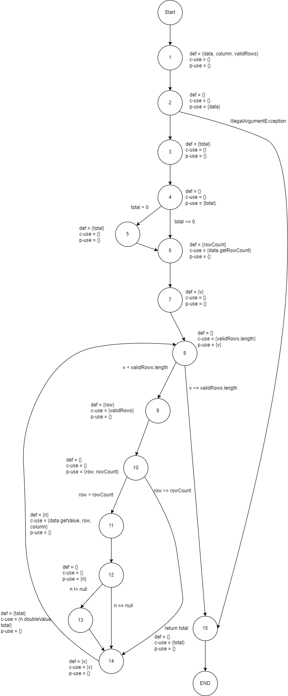
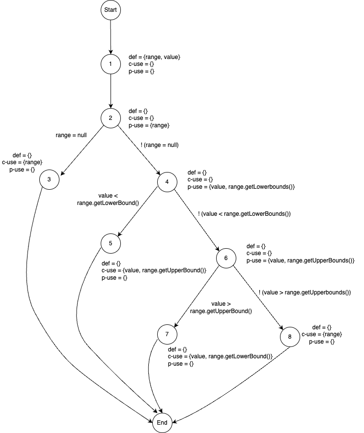

**SENG 637 - Dependability and Reliability of Software Systems**

**Lab. Report #3 – Code Coverage, Adequacy Criteria and Test Case Correlation**

| Group: 10       | 
|-----------------|
| Amey Brahme     |   
| Tejpreet Bal    |   
| Dhananjay Roy   |   
| Harshil Patel   |   
| Munal Akhtar    |   

(Note that some labs require individual reports while others require one report
for each group. Please see each lab document for details.)

# 1 Introduction

This assignment aims to develop our understanding of assessing the effectiveness of a white-box test suite through code coverage. It builds on the automated unit testing principles from Assignment 2, using the JUnit tool in Eclipse. Unlike Assignment 2, here we focus on enhancing the test suite and creating test cases based on various white-box testing criteria, including control flow (statement, decision, condition, and method coverage) and data flow (DU pairs coverage). Implementing white-box testing allows us to validate unit tests at the unit testing level. The coverage tools also identify the extent of completed unit testing and highlight areas that require attention. Overall, white-box testing facilitates a more thorough and in-depth testing phase in the software development cycle by examining all possible code paths.

# 2 Manual data-flow coverage calculations for X and Y methods

  2.1. DataUtilities.calculateColumnTotal(Values2D data, int column, int[] validRows)

  The three-argument calculateColumnTotal method was chosen out of the two methods with the same name. The following are
  the steps and calculations to calculate the all-uses coverage for this method.

  Data Flow Graph:

  

Defs, Uses and DU Pairs

|                |                                                           |
| -------------- | ----------------------------------------------------------| 
| defs:          | def(1) = {data, column, validRows}                        |     
|                | def(3) = {total}                                          |
|                | def(5) = {total}                                          |
|                | def(6) = {rowCount}                                       |
|                | def(7) = {v}                                              |
|                | def(9) = {row}                                            |
|                | def(11) = {n}                                             |
|                | def(13) = {total}                                         |
|                | def(14) = {v}                                             |
| uses:          | use(2) = (data}                                           |
|                | use(4) = {total}                                          |
|                | use(6) = {data}                                           |
|                | use(8) = {validRows, v}                                   |
|                | use(9) = {validRows}                                      |
|                | use(10) = {row, rowCount}                                 |
|                | use(11) = {data, row, column}                             |
|                | use(12) = {n}                                             |
|                | use(13) = {n, total}                                      |
|                | use(14) = {v}                                             |
|                | use(15) = {total}                                         |
| du-pairs       |                                                           |
| for data:      | (1, 2), (1, 6), (1, 11)                                   |
| for column:    | (1, 11)                                                   |
| for validRows: | (1, 8), (1, 9)                                            |
| for total:     | (3, 4), (3, 5) (3,13), (3, 15), (5, 13), (5, 15), (13, 15) |
| for rowCount:  | (6, 10)                                                   |
| for v:         | (7, 8), (7, 14), (14, 8), (14, 14)                        |
| for row:       | (9, 10), (9, 11)                                          |
| for n:         | (11, 12), (11, 13)                                        |

Defs, c-use and p-use pairs by variable for coverage calculation

| Variable  | Def at node n | dcu(v, n) | dpu(v, n)            |
| --------- | ------------- | --------- | -------------------- |
| data      | 1             | {6, 11}   | {(2, 3), (2, 15)}    |
| column    | 1             | {11}      | {}                   |
| validRows | 1             | {9}       | {(8, 9), (8, 15)}    |
| total     | 3             | {13}      | {(4, 5), (4, 6)}     |
| total     | 5             | {13}      | {}                   |
| total     | 13            | {13}      | {}                   |
| rowCount  | 6             | {}        | {(10, 11), (10, 14)} |
| v         | 7             | -         | -                    |
| v         | 14            | {14}      | {(8, 9), (8, 15)}    |
| row       | 9             | {11}      | {(10, 11), (10, 14)) |
| n         | 11            | {}        | {(12, 13), (12, 14)} |
|           | Total         | CU = 9    | PU = 14              |

DU Pair Coverage Calculation (Per test case and overall)

| Test Case                                          | Execution path                                   | DU-pairs covered                                                                                                                                    | CUc + PUc                                                                                                                                               | CUf + PUf | All-uses Coverage |
| -------------------------------------------------- | ------------------------------------------------ | --------------------------------------------------------------------------------------------------------------------------------------------------- | ------------------------------------------------------------------------------------------------------------------------------------------------------- | --------- | ----------------- |
| calculateColumnTotalOfFiveCols()                   | [1, 2, 3, 4, 6, 7, 8, 9, 10, 11, 12, 14, 15]     | (1, 2), (1, 6), (1, 8), (1, 9), (1, 11), (3, 4), (3, 13), (3, 15), (6, 10), (7, 8), (7, 14), (14, 8), (14, 14), (9, 10), (9, 11), (11, 12),         | {6, 11}, {11}, {9}, {13}, {13}, {14}, {11}, (2, 3),( 8, 9), (8, 15), (4, 6) (10, 11), (10, 14), (8, 9), (8, 15), (10, 11), (10, 14), (12, 14)           | (4, 5)    | 86%               |
| calculateColumnTotalFirstMidLast()                 | [1, 2, 3, 4, 6, 7, 8, 9, 10, 11, 12, 14, 15]     | (1, 2), (1, 6), (1, 8), (1, 9), (1, 11), (3, 4), (3, 13), (3, 15), (6, 10),(7, 8), (7, 14), (14, 8), (14, 14), (9, 10), (9, 11), (11, 12),          | {6, 11}, {11}, {9}, {13}, {13}, {14}, {11}, (2, 3),( 8, 9), (8, 15), (4, 6) (10, 11), (10, 14), (8, 9), (8, 15), (10, 11), (10, 14), (12, 14)           | (4, 5)    | 86%               |
| calculateColumnTotalFirstAndLast()                 | [1, 2, 3, 4, 6, 7, 8, 9, 10, 11, 12, 14, 15]     | (1, 2), (1, 6), (1, 8), (1, 9), (1, 11), (3, 4), (3, 13), (3, 15), (6, 10),(7, 8), (7, 14), (14, 8), (14, 14), (9, 10), (9, 11), (11, 12),          | {6, 11}, {11}, {9}, {13}, {13}, {14}, {11}, (2, 3),( 8, 9), (8, 15), (4, 6) (10, 11), (10, 14), (8, 9), (8, 15), (10, 11), (10, 14), (12, 14)           | (4, 5)    | 86%               |
| calculateColumnTotalOutOfRangeIndex()              | [1, 2, 3, 4, 6, 7, 8, 9, 10, 11, 12, 14, 15]     | (1, 2), (1, 6), (1, 8), (1, 9), (1, 11), (3, 4), (3, 13), (3, 15), (6, 10),(7, 8), (7, 14), (14, 8), (14, 14), (9, 10), (9, 11), (11, 12),          | {6, 11}, {11}, {9}, {13}, {13}, {14}, {11}, (2, 3),( 8, 9), (8, 15), (4, 6) (10, 11), (10, 14), (8, 9), (8, 15), (10, 11), (10, 14), (12, 14)           | (4, 5)    | 86%               |
| calculateColumnTotalMaxRowIndex()                  | [1, 2, 3, 4, 6, 7, 8, 9, 10, 11, 12, 14, 15]     | (1, 2), (1, 6), (1, 8), (1, 9), (1, 11), (3, 4), (3, 13), (3, 15), (6, 10),(7, 8), (7, 14), (14, 8), (14, 14), (9, 10), (9, 11), (11, 12), (11, 13) | {6, 11}, {11}, {9}, {13}, {13}, {14}, {11}, (2, 3),( 8, 9), (8, 15), (4, 6) (10, 11), (10, 14), (8, 9), (8, 15), (10, 11), (10, 14), (12, 14)           | (4, 5)    | 86%               |
| calculateColumnTotalMaxRowMaxColIndexes()          | [1, 2, 3, 4, 6, 7, 8, 9, 10, 11, 12, 14, 15]     | (1, 2), (1, 6), (1, 8), (1, 9), (1, 11), (3, 4), (3, 13), (3, 15), (6, 10),(7, 8), (7, 14), (14, 8), (14, 14), (9, 10), (9, 11), (11, 12), (11, 13) | {6, 11}, {11}, {9}, {13}, {13}, {14}, {11}, (2, 3),( 8, 9), (8, 15), (4, 6) (10, 11), (10, 14), (8, 9), (8, 15), (10, 11), (10, 14), (12, 14)           | (4, 5)    | 86%               |
| calculateColumnTotalWithOneNullValueAllRowsValid() | [1, 2, 3, 4, 6, 7, 8, 9, 10, 11, 12, 13, 14, 15] | (1, 2), (1, 6), (1, 8), (1, 9), (1, 11), (3, 4), (3, 13), (3, 15), (6, 10),(7, 8), (7, 14), (14, 8), (14, 14), (9, 10), (9, 11), (11, 12), (11, 13) | {6, 11}, {11}, {9}, {13}, {13}, {14}, {11}, (2, 3),( 8, 9), (8, 15), (4, 6) (10, 11), (10, 14), (8, 9), (8, 15), (10, 11), (10, 14), (12, 13), (12, 14) | (4, 5)    | 91%               |
| calculateColumnTotalWithTwoNullValueAllRowsValid() | [1, 2, 3, 4, 6, 7, 8, 9, 10, 11, 12, 13, 14, 15] | (1, 2), (1, 6), (1, 8), (1, 9), (1, 11), (3, 4), (3, 13), (3, 15), (6, 10),(7, 8), (7, 14), (14, 8), (14, 14), (9, 10), (9, 11), (11, 12), (11, 13) | {6, 11}, {11}, {9}, {13}, {13}, {14}, {11}, (2, 3),( 8, 9), (8, 15), (4, 6) (10, 11), (10, 14), (8, 9), (8, 15), (10, 11), (10, 14), (12, 13), (12, 14) | (4, 5)    | 91%               |
| calculateColumnTotalWithSingleNullValue()          | [1, 2, 3, 4, 6, 7, 8, 9, 10, 11, 12, 14, 15]     | (1, 2), (1, 6), (1, 8), (1, 9), (1, 11), (3, 4), (3, 13), (3, 15), (6, 10), (7, 8), (7, 14), (14, 8), (14, 14), (9, 10), (9, 11), (11, 12)          | {6, 11}, {11}, {9}, {13}, {13}, {14}, {11}, (2, 3),( 8, 9), (8, 15), (4, 6) (10, 11), (10, 14), (8, 9), (8, 15), (10, 11), (10, 14), (12, 13)           | (4, 5)    | 91%               |
| calculateColumnTotalWithNoValidRows()              | [1, 2, 3, 4, 6, 7, 8, 15]                        | (1, 2), (1, 6), (1, 8), (3, 4), (3, 15), (7, 8)                                                                                                     | {6}, (2, 3), (8, 15), (4, 6), (8, 15)                                                                                                                   | (4, 5)    | 24%               |
| calculateColumnTotalWithNullDataArgument()         | [1, 2, 15]                                       | (1, 2)                                                                                                                                              | (2, 15)                                                                                                                                                 | (4, 5)    | 5%                |

Overall coverage:

CUc + PUc = 21

CU + PU = 23

CUf + PUf = 1

All Uses Coverage = 95%

2.2. Range.expandToInclude(Range range, double value)

Class: Range
Function: ExpandToInclude: The following are
the steps and calculations to calculate the all-uses coverage for this method.

Defs, user and du-pairs

| defs:         | def(1) = {range, value}                             |
| ------------- | --------------------------------------------------- |
| uses:         | use(2) = {range}                                    |
|               | use(3) = {range}                                    |
|               | use(4) = {range, value}                             |
|               | use(5) = {range, value}                             |
|               | use(6) = {range.value}                              |
|               | use(7) = {range.value}                              |
|               | use(8) = {range}                                    |
| du-pairs:     | for range: (1,2), (1,3), (1,4), (1,5), (1,6), (1,8) |
|               | For value: (1,4), (1,5), (1,6)                      |
| DataUtilities | getCumulativePercentages()                          |

Du-pari coverage calculatino per test case

| Variable | Def at node (n) | dcu(v,n)     | dpu(v,n)                                   |
| -------- | --------------- | ------------ | ------------------------------------------ |
| range    | 1               | {3, 5, 7, 8} | {(2,3), (2,4), (4,5), (4,6), (6,7), (6,8)} |
| value    | 1               | {5, 7}       | {(4,5), (4,6), (6,7), (6,8)}               |
|          |                 | CU = 6       | PU = 10                                    |

| Test Case                                       | Execution path  | DU-pairs covered   | Cuc + Puc                                   | All-uses Coverage |
| ----------------------------------------------- | --------------- | ------------------ | ------------------------------------------- | ----------------- |
| expandToIncludeWithInputBLB()                   | [1, 2, 4, 5]    | (1,2), (1,4)       | {5}, {5}, (2,4), (4,5), (4,5)               | 31.25%            |
| expandToIncludeWithInputLB()                    | [1, 2, 4, 6, 8] | (1,2), (1,4),(1,6) | {8}, (2,4), (4,6), (4,6), (6,8), (6,8)      | 37.50%            |
| expandToIncludeWithInputALB()                   | [1, 2, 4, 6, 8] | (1,2), (1,4),(1,6) | {8}, (2,4), (4,6), (4,6), (6,8), (6,8)      | 37.50%            |
| expandToIncludeWithInputBUB()                   | [1, 2, 4, 6, 8] | (1,2), (1,4),(1,6) | {8}, (2,4), (4,6), (4,6), (6,8), (6,8)      | 37.50%            |
| expandToIncludeWithInputUB()                    | [1, 2, 4, 6, 8] | (1,2), (1,4),(1,6) | {8}, (2,4), (4,6), (4,6), (6,8), (6,8)      | 37.50%            |
| expandToIncludeWithInputAUB()                   | [1, 2, 4, 6, 7] | (1,2), (1,4),(1,6) | {7}, {7}, (2,4), (4,6), (4,6), (6,7), (6,7) | 43.77%            |
| expandToIncludeWithInputOneMoreNominalValue()   | [1, 2, 4, 6, 8] | (1,2), (1,4),(1,6) | {8}, (2,4), (4,6), (4,6), (6,8), (6,8)      | 37.50%            |
| expandToIncludeWithInputOneLessNominalValue()   | [1, 2, 4, 6, 8] | (1,2), (1,4),(1,6) | {8}, (2,4), (4,6), (4,6), (6,8), (6,8)      | 37.50%            |
| expandToIncludeWithInputNominalValue()          | [1, 2, 4, 6, 8] | (1,2), (1,4),(1,6) | {8}, (2,4), (4,6), (4,6), (6,8), (6,8)      | 37.50%            |
| expandToIncludeWithNullRangeInputNominalValue() | [1, 2, 3]       | (1,2)              | {3}, (2,3)                                  | 12.50%            |

Total

Cuc + PUc = 16

CU + PU = 16

All-uses coverage = 100%

# 3 A detailed description of the testing strategy for the new unit test

The overall testing strategy for this assignment was to run EclEmma on the original Assignment 2 tests developed on the
source code given in the Assignment 3 artifacts. Once the code coverage tool provided the coverage results on the
'before' state, we improved or added to the existing tests for the 10 methods chosen in Assignment 2. These methods are:

Range

- `expandToInclude(Range range, double value)`
- `expand(Range range, double lowerMargin, double upperMargin)`
- `intersects(double b0, double b1)`
- `shift(Range base, double delta, boolean allowsZeroCrossing)`
- `scale(Range base, double factor)`

DataUtilities

- `calculateColumnTotal(Values2D data, int column, int[] validRows)`
- `calculateRowTotal(Values2D data, int row, int[] validCols)`
- `createNumberArray(double[] data)`
- `createNumberArray2D(double[][] data)`
- `getCumulativePercentages(KeyedValues data)`

Because of our interpretation of the line, branch and condition/method coverage applying to the whole class during the
Winter Term break, and not the methods chosen in Assignment 2, we continued to add new tests for the methods that we
didn't cover in Assignment 2 until the minimum coverage was reached for each class, and for each of the original 10
methods in JFreeChart. The following is the list of new methods covered.

Range

- `combine(Range range1, Range range2)`
- `combineIgnoringNaN(Range range1, Range range2)`
- `constrain(double value)`
- `contains(double value)`
- `equals(Object obj)`
- `getCentralValue()`
- `getLength()`
- `getLowerBound()`
- `getUpperBound()`
- `hashCode()`
- `intersects(Range range)`
- `isNaNRange()`
- `shift(Range base, double delta)`

DataUtilities

- `calculateColumnTotal(Values2D data, int column)`
- `calculateRowTotal(Values2D data, int row)`
- `clone(double[][] source)`
- `equal(double[][] a, double[][] b)`

The overall strategy when writing the new unit tests was to run the code coverage tool, visually inspect the coverage,
and then write a test that would cover a line, branch or condition that was missing. The code coverage tool was then
run again once the new unit test was written. Once coverage was attained for the method under test, test development
for that test was considered complete for the method. Once coverage was attained for the class overall, unit test
writing was considered complete for the class. Unit tests were revisited as needed.
# 4 A high level description of five selected test cases you have designed using coverage information, and how they have increased code coverage

Text…

# 5 A detailed report of the coverage achieved of each class and method (a screen shot from the code cover results in green and red color would suffice)

Text…

# 6 Pros and Cons of coverage tools used and Metrics you report

Text…

# 7 A comparison on the advantages and disadvantages of requirements-based test generation and coverage-based test generation.

Text…

# 8 A discussion on how the team work/effort was divided and managed

Text…

# 9 Any difficulties encountered, challenges overcome, and lessons learned from performing the lab

Text…

# 10 Comments/feedback on the lab itself

Text…
